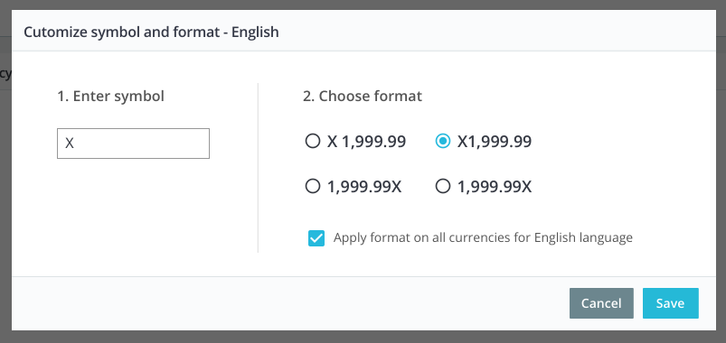
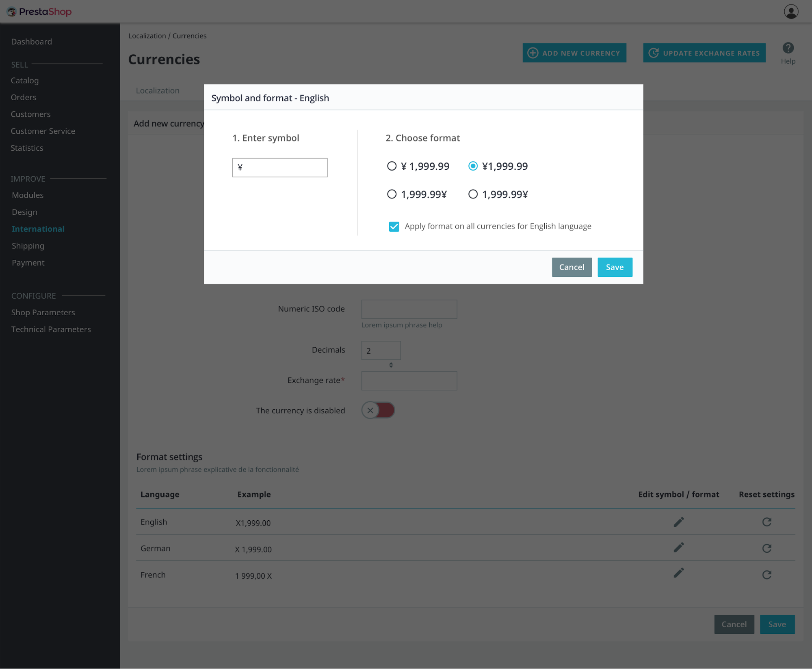

Currency format setting

CLDR and all that stuff

[USER STORY](#h.3e2a5w18070m)        [1](#h.3e2a5w18070m)

[WHY](#h.401yn69xtlzi)        [1](#h.401yn69xtlzi)

[SPECIFICATION](#h.c4gagjhy83n2)        [2](#h.c4gagjhy83n2)

[DETAILED SPECIFICATION](#h.nobzb7sgzndl)        [2](#h.nobzb7sgzndl)

[Add a currency](#h.do28l6lwu765)        [2](#h.do28l6lwu765)

[Edit a currency](#h.bqpbv8j08ren)        [3](#h.bqpbv8j08ren)

[DESIGN](#h.qlrmv8ogeh9)        [4](#h.qlrmv8ogeh9)

[Failing cases](#h.r0wohygkei9o)        [4](#h.r0wohygkei9o)

[Error/Warning case:](#h.xwgqu5ggq5u2)        [4](#h.xwgqu5ggq5u2)

[ISSUES RELATED](#h.mjnjpabfb0dy)        [4](#h.mjnjpabfb0dy)

[OLD SPECIFICATION](#h.c41vtkdf32je)        [5](#h.c41vtkdf32je)

[ACCEPTANCE CRITERIA](#h.td1hpanbhaeo)        [5](#h.td1hpanbhaeo)

* * *

# USER STORY

Localization > Currencies > Edit/Add Page

As a merchant, I want to manage the display of my currencies in the Front Office depending on the language if needed in order to adapt my shop to my clients visual expectations.

# WHY

We have understand there is a big complexity on the currency display choose when you shop is for B2C or B2B, or when you sell on countries sharing the same symbol currency as in Latin America countries with the pesos. Each merchant as it own currency format problematics, so we allow the merchant the possibility to custom the currency format depending of any language of their shops.

The currency format will have now be fully customizable assisted by the CLDR.

Reminder, the CLDR (Common Locale Data Repository) is a database containing the convention of different languages as format date, currencies and more shared by the biggest companies. It will be the main source to provide the best currencies pre-configuration to the merchant.

The merchant don’t have to worry about their currencies display anymore but they still can edit if needed. Their shop won’t look suspicious because of a wrong currency displayed. The currency display will adapt itself to every of their customers.

# SPECIFICATION

The implementation of the CLDR database and the feature to change the currency display in the FO  by language is already done (Here the first part [#10052](https://www.google.com/url?q=https://github.com/PrestaShop/PrestaShop/issues/10052&sa=D&ust=1548418107666000)).

Remaining improvements features of the Page Add Currency and Edit Currency in Page Currencies of Localization Category is the format setting. It allows:

*   To edit currency symbol by language
*   To edit symbol position by language for all the currencies
*   The separating symbol of thousands and decimals is only configured by the CLDR

It’s the second part of the page currency adding and edition. It has the languages list with the currency display according to the language next to it. It will be possible for the merchant to edit the currency format or to reset it by language. By default, the format setting (position and symbol, decimals, separating symbol) is configure by the CLDR.

# DETAILED SPECIFICATION

## Add a currency

When the page is loaded, the currency symbol on the language list will be displayed with X.

If the merchant selects a currency from the drop list before, it will present the example with the right currency symbol with the CLDR settings (position and symbol, decimals, separating symbol by language).

On the second case for custom currency, the CLDR preconfigure the position and separating symbol by language until the merchant edit the symbol and the decimal. After it, the currency symbol edited will replace the “X”.

A currency symbol position (right, left with or without space) saved for a language will be saved for all the currencies for the selected language.

Wording is needed to explain that the format part changes will be applied for all the currencies.[[a]](#cmnt1)[[b]](#cmnt2)[[c]](#cmnt3)[[d]](#cmnt4)

Format setting on the bottom of the currency form.

pop-in after the click on edit when no symbol was filled.

The merchant can reset the format of a language by clicking on the reset button next to the edit button.

## Edit a currency

All the inputs is full filled by saved data. So when the user edits the format, a pop-in will open in which the user can change the symbol and its position on the price display through a radio button.

The decimals and thousands separating format are defined by the CLDR, so for each language, the radio have an adapted display. The currency symbol in the radio is also displaying the symbol of currency that the user is editing.

# DESIGN

[https://projects.invisionapp.com/d/main#/console/16335086/338742836/preview](https://www.google.com/url?q=https://projects.invisionapp.com/d/main%23/console/16335086/338742836/preview&sa=D&ust=1548418107669000)

## Failing cases

## Error/Warning case:

# ISSUES RELATED

*   [#9714](https://www.google.com/url?q=https://github.com/PrestaShop/PrestaShop/issues/9714&sa=D&ust=1548418107670000)
*   [#10014](https://www.google.com/url?q=https://github.com/PrestaShop/PrestaShop/issues/10014&sa=D&ust=1548418107671000)
*   [#10017](https://www.google.com/url?q=https://github.com/PrestaShop/PrestaShop/issues/10017&sa=D&ust=1548418107671000)
*   [#10055](https://www.google.com/url?q=https://github.com/PrestaShop/PrestaShop/issues/10055&sa=D&ust=1548418107672000)
*   [#10054](https://www.google.com/url?q=https://github.com/PrestaShop/PrestaShop/issues/10054&sa=D&ust=1548418107672000)
*   [#10053](https://www.google.com/url?q=https://github.com/PrestaShop/PrestaShop/issues/10053&sa=D&ust=1548418107673000)
*   [#9885](https://www.google.com/url?q=https://github.com/PrestaShop/PrestaShop/issues/9885&sa=D&ust=1548418107673000)

# OLD SPECIFICATION

*   [#10058](https://www.google.com/url?q=https://github.com/PrestaShop/PrestaShop/issues/10058&sa=D&ust=1548418107674000)
*   [#11690](https://www.google.com/url?q=https://github.com/PrestaShop/PrestaShop/pull/11690&sa=D&ust=1548418107674000)

# ACCEPTANCE CRITERIA

To be completed with QA and developers.

Given... [a context],

when... [users does something],

then... [what the user should observe]

WORDING

[[a]](#cmnt_ref1)+louise.bonnard@prestashop.com

Your talent is required please. Call me if you need more context

[[b]](#cmnt_ref2)Isn't there already a wording to explain it? I can see "Apply format on all currencies for English language" with a ticking box.

[[c]](#cmnt_ref3)The check box will be removed because it will apply by default it to all the languages

[[d]](#cmnt_ref4)'(Please) note that the selected format will apply all currencies' ?
